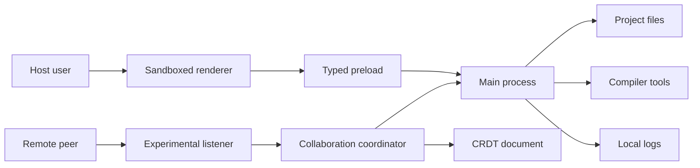

# Collaboration Threat Model

## Executive summary

Sprint 14 does not implement collaboration; it defines the security envelope for
a future experimental local-network collaboration mode. The highest-risk themes
are remote peer influence over source integrity, accidental host filesystem or
compiler authority exposure, denial of service through CRDT/message growth, and
privacy leakage of source content or invitation secrets. The recommended design
keeps collaboration disabled by default, host-authoritative, local-network only,
schema-validated, bounded, and isolated from the stable offline path.

## Scope and assumptions

In scope:

- `docs/SRS.md` Sprint 14 collaboration research requirements.
- Current Electron, IPC, project, compiler, recovery, support, and renderer
  boundaries.
- Future experimental collaboration design described in
  `docs/COLLABORATION_SRS.md`.

Out of scope:

- A shipped collaboration runtime.
- Hosted services, account systems, WebRTC relay/signaling, remote build
  workers, cloud project storage, comments, tracked changes, and public project
  sharing.
- CI/build tooling except where dependency and packaging controls affect future
  collaboration code.

Assumptions:

- The first prototype is local-network or loopback WebSocket, not public
  internet.
- The host intentionally starts a session and retains project-file and compiler
  authority.
- Guests may be honest, curious, faulty, or malicious.
- Guest source edits may include malicious TeX, but TeX execution remains the
  host user's local trust decision.
- No collaboration code loads unless a future experimental flag is enabled.

Open questions that would change risk ranking:

- Will LAN binding be supported in the first prototype or loopback only?
- Will guests ever be allowed to request compilation?
- Will source content be encrypted end-to-end between peers, or only protected
  by local transport controls?

## System model

### Primary components

- Stable renderer: React, CodeMirror, PDF.js, and current 34-method preload
  bridge.
- Stable Electron main process: trusted IPC handlers, `ProjectSession`,
  `ProjectService`, `BuildController`, compiler adapter, settings, recovery,
  support logs, and packaged resource handling.
- Future collaboration host: experimental listener and session coordinator,
  disabled by default.
- Future CRDT layer: likely Yjs updates for shared text buffers.
- Remote peers: guest clients connected with an invitation secret.

Evidence anchors:

- `docs/ARCHITECTURE.md` describes the renderer/main/project/compiler boundaries
  and stable preload bridge.
- `src/electron/preload.ts` exposes only fixed current stable methods.
- `src/electron/project-ipc.ts` validates trusted sender/frame and schemas for
  current IPC.
- `src/project/project-service.ts` owns canonical project file operations.
- `docs/COLLABORATION_SRS.md` defines the future collaboration scope and
  authority model.

### Data flows and trust boundaries

- Host user -> stable renderer: project actions, edits, settings, and compile
  controls through UI events; no Node access in renderer; React escapes text.
- Stable renderer -> preload -> main process: typed fixed IPC with trusted
  sender/frame checks and strict schemas.
- Main process -> project filesystem: canonical project service, version-token
  checks, link rejection, and generated-output exclusions.
- Main process -> MiKTeX tools: shell-free argument arrays, timeout,
  cancellation, output bounds, shell escape disabled by default.
- Future guest -> collaboration listener: WebSocket messages carrying invitation
  proof, text updates, presence, and optional requests; must be authenticated,
  schema validated, rate limited, and bounded.
- Future collaboration coordinator -> stable project/session services:
  host-mediated application of accepted text state; no guest filesystem paths or
  compiler arguments cross this boundary.
- Main process -> support logs: bounded local structured events; source content
  and invitation secrets must be omitted by default.

#### Diagram

## Assets and security objectives

| Asset                            | Why it matters                                                        | Security objective (C/I/A)               |
| -------------------------------- | --------------------------------------------------------------------- | ---------------------------------------- |
| Project source files             | User-owned documents and research content                             | Confidentiality, integrity, availability |
| Project metadata and settings    | Controls root file, build directory, recipes, and trust decisions     | Integrity                                |
| Host filesystem boundary         | Prevents remote peer escalation from project edits to arbitrary files | Confidentiality, integrity               |
| Local compiler authority         | TeX and trusted tools run with host user permissions                  | Integrity, availability                  |
| Generated PDFs/logs              | May contain sensitive source-derived content and local paths          | Confidentiality, integrity               |
| Invitation secrets/session state | Controls guest access to shared buffers                               | Confidentiality, integrity               |
| CRDT update history              | Can grow large and can influence final source text                    | Integrity, availability                  |
| Application logs/recovery        | May preserve troubleshooting and unsaved source-adjacent state        | Confidentiality, integrity               |

## Attacker model

### Capabilities

- Connect as a guest if they obtain an invitation secret or can reach an exposed
  listener.
- Send malformed, oversized, replayed, high-rate, or semantically malicious
  collaboration messages.
- Insert malicious TeX source text into a shared buffer if the host accepts
  editing.
- Attempt to infer local paths, project structure, or source content from
  protocol responses and logs.
- Attempt denial of service by peer churn, message floods, or CRDT state growth.

### Non-capabilities

- No direct renderer Node, filesystem, or process access through the current
  stable preload bridge.
- No direct project file mutation in the first prototype beyond host-mediated
  text state.
- No direct compiler process control, custom executable selection, shell escape
  enabling, or `.latexmkrc` trust decision.
- No public internet service or hosted relay in the first prototype.

## Entry points and attack surfaces

| Surface                       | How reached                    | Trust boundary                 | Notes                                                                 | Evidence                                                 |
| ----------------------------- | ------------------------------ | ------------------------------ | --------------------------------------------------------------------- | -------------------------------------------------------- |
| Stable preload IPC            | Renderer invokes fixed methods | Renderer to main               | Current schemas and trusted sender checks protect stable path         | `src/electron/preload.ts`; `src/electron/project-ipc.ts` |
| Project file service          | Main process file operations   | Main to filesystem             | Canonical root, version tokens, link rejection                        | `src/project/project-service.ts`; `docs/ARCHITECTURE.md` |
| Compiler adapter              | Main process build requests    | Main to local tools            | Shell-free, timeout, no shell escape by default                       | `src/compiler/miktex-compiler.ts`; `docs/SECURITY.md`    |
| Future collaboration listener | Guest WebSocket messages       | Remote peer to host            | Must be feature-flagged, authenticated, bounded, and schema validated | `docs/COLLABORATION_SRS.md`                              |
| Future CRDT updates           | Guest text edits               | Remote peer to shared document | Updates can influence source integrity and memory growth              | `docs/COLLABORATION_SRS.md`                              |
| Future presence data          | Guest display metadata         | Remote peer to renderer        | Untrusted text must remain bounded and escaped                        | `docs/COLLABORATION_SRS.md`; `src/renderer/`             |
| Support logs                  | Runtime diagnostic events      | Main to local log file         | Must not store invitation secrets/source content by default           | `docs/SECURITY.md`; `src/support/application-log.ts`     |

## Top abuse paths

1. Remote peer obtains an invitation secret -> connects to the host listener ->
   sends text edits containing malicious TeX -> host compiles later -> local TeX
   execution impacts host integrity or availability.
2. Remote peer sends absolute or traversal-like file identifiers -> weak
   coordinator maps them to host paths -> project service is bypassed -> host
   files outside the project are read or changed.
3. Remote peer floods CRDT updates -> coordinator retains unbounded state ->
   memory or CPU grows -> editor/build workflow becomes unavailable.
4. Remote peer sends malformed protocol messages -> parser or schema gap causes
   exception loops -> collaboration session or app crashes.
5. Remote peer sends crafted presence/display text -> renderer renders it
   unsafely -> UI spoofing or script injection if escaping/CSP are weakened.
6. Remote peer requests compilation repeatedly -> host accepts without rate or
   permission checks -> local compiler processes consume CPU/disk.
7. Invitation secret is logged or displayed too broadly -> another LAN user
   joins -> source confidentiality and integrity are compromised.
8. Collaboration feature loads by default -> listener opens on startup -> the
   stable offline release gains unexpected network exposure.

## Threat model table

| Threat ID | Threat source             | Prerequisites                                      | Threat action                                                                 | Impact                                                                  | Impacted assets                                     | Existing controls (evidence)                                                                   | Gaps                                                                                  | Recommended mitigations                                                                                                                                   | Detection ideas                                                                         | Likelihood | Impact severity | Priority |
| --------- | ------------------------- | -------------------------------------------------- | ----------------------------------------------------------------------------- | ----------------------------------------------------------------------- | --------------------------------------------------- | ---------------------------------------------------------------------------------------------- | ------------------------------------------------------------------------------------- | --------------------------------------------------------------------------------------------------------------------------------------------------------- | --------------------------------------------------------------------------------------- | ---------- | --------------- | -------- |
| TM-001    | Malicious guest           | Guest can connect and edit shared source           | Insert malicious TeX or configuration text that the host later compiles       | Host local code/data exposure through TeX/tool behavior or resource use | Project source, compiler authority, host filesystem | Shell escape disabled, timeout, output bounds, `.latexmkrc` trust warning (`docs/SECURITY.md`) | Collaboration may make malicious text feel peer-supplied rather than project-supplied | Display remote-edit attribution before compile; keep guest compile disabled by default; never let guests change trust settings; preserve shell escape off | Log guest compile requests and remote-edited-source compile attribution without content | Medium     | High            | High     |
| TM-002    | Malicious guest           | Protocol accepts file identifiers or operations    | Send traversal, absolute paths, symlink targets, or project mutation requests | Unauthorized file read/write/delete                                     | Host filesystem, project source                     | Project service canonicalizes and rejects path escapes (`src/project/project-service.ts`)      | Future coordinator could bypass service if designed as sync layer                     | Route all persistence through `ProjectService`; reject remote file ops in first prototype; use project-relative IDs only                                  | Security event for rejected remote path/file-op messages                                | Medium     | High            | High     |
| TM-003    | Malicious or faulty peer  | Guest can send updates at high rate or size        | Flood CRDT or presence messages and force unbounded merge/state retention     | App unresponsive or session unavailable                                 | Availability, CRDT state                            | Existing process/log/output bounds show bounded-design pattern (`docs/SECURITY.md`)            | No collaboration-specific limits exist yet                                            | Enforce max peers, message bytes, update rate, retained state, and disconnect thresholds                                                                  | Count rejected oversized/rate-limited messages and peer disconnect reasons              | High       | Medium          | High     |
| TM-004    | Network-adjacent attacker | Listener binds beyond loopback or invitation leaks | Join or probe collaboration session                                           | Source confidentiality/integrity loss                                   | Source files, invitation secrets                    | No listener exists today; stable app has no network service (`docs/SECURITY.md`)               | Future LAN listener needs auth, binding, and warning controls                         | Loopback default; explicit LAN action; short-lived invitation secrets; random high-entropy tokens; no secret logging                                      | Log session start/stop, bind address class, failed auth counts                          | Medium     | High            | High     |
| TM-005    | Malicious guest           | Guest controls presence/name/cursor labels         | Send spoofing or markup-like display data                                     | UI deception or XSS if rendering controls regress                       | Renderer UI, user decisions                         | React escaping and CSP protect current UI (`docs/SECURITY.md`)                                 | Future presence UI may add rich rendering                                             | Bound and escape all presence fields; no HTML rendering; clear peer identity affordances                                                                  | Log rejected oversized/invalid presence messages                                        | Medium     | Medium          | Medium   |
| TM-006    | Malicious guest           | Host enables guest compile requests                | Spam compile requests or select expensive source states                       | CPU/disk exhaustion; degraded editing                                   | Compiler availability, generated output             | Build controller serializes and times out local compiles (`docs/ARCHITECTURE.md`)              | Remote rate/permission controls not implemented                                       | Guest compile disabled by default; host permission toggle; debounce/rate limits; queue coalescing by host                                                 | Log remote compile requests, denials, and rate limits                                   | Medium     | Medium          | Medium   |
| TM-007    | Faulty implementation     | Collaboration loads without feature flag           | Stable offline startup opens listener or expands preload                      | Unexpected network exposure and larger attack surface                   | Stable product boundary                             | Current stable bridge has fixed 32 methods (`src/electron/preload.ts`)                         | Future implementation may blur stable/experimental paths                              | Gate all collaboration imports, UI, IPC, and listeners behind explicit flag; test absence by default                                                      | Startup log includes collaboration disabled/enabled state without secrets               | Low        | High            | Medium   |
| TM-008    | Malicious guest or bug    | Logs include protocol payloads/secrets             | Source snippets or invitation secrets persist in local support log            | Privacy loss during support export                                      | Source content, invitation secrets, logs            | Existing support logs avoid source content by default (`docs/SECURITY.md`)                     | Collaboration-specific redaction rules not implemented                                | Never log payload text or secrets; hash peer IDs; redact tokens; add support-export redaction cases                                                       | Tests scan exported support log for known test secret/source strings                    | Medium     | Medium          | Medium   |

## Criticality calibration

- Critical: public-internet pre-auth host file write, remote compiler command
  execution, or collaboration enabled by default with unauthenticated access.
- High: connected guest can escape project boundaries, trigger host compilation
  without host authority, or exfiltrate shared source through weak session
  controls.
- Medium: connected guest can cause bounded denial of service, spoof presence,
  or leak low-sensitivity metadata.
- Low: issues requiring the host to enable the experimental flag, share an
  invitation, and accept a visible prompt, with no filesystem/compiler impact.

## Focus paths for security review

| Path                                                    | Why it matters                                                                      | Related Threat IDs     |
| ------------------------------------------------------- | ----------------------------------------------------------------------------------- | ---------------------- |
| `docs/COLLABORATION_SRS.md`                             | Source of future collaboration authority, transport, and feature-flag requirements  | TM-001 through TM-008  |
| `docs/adr/ADR-0015-collaboration-research-prototype.md` | Records transport and CRDT decisions that define attack surface                     | TM-003, TM-004, TM-007 |
| `src/electron/preload.ts`                               | Future experimental methods must not alter stable preload by default                | TM-002, TM-007         |
| `src/electron/project-ipc.ts`                           | Existing IPC validation pattern should be reused for collaboration control messages | TM-002, TM-007         |
| `src/project/project-service.ts`                        | All host persistence must keep canonical path and version-token checks              | TM-002                 |
| `src/compiler/miktex-compiler.ts`                       | Remote compile requests must never become process arguments or trust decisions      | TM-001, TM-006         |
| `src/support/application-log.ts`                        | Collaboration events must avoid source payloads and invitation secrets              | TM-008                 |
| `src/renderer/`                                         | Presence and attribution UI must escape untrusted peer text                         | TM-005                 |

## Quality check

- Covered the currently discovered stable entry points and the proposed future
  collaboration listener.
- Represented every new trust boundary in at least one abuse path and threat.
- Separated runtime behavior from CI/build tooling and from future prototype
  work.
- Proceeded with explicit Sprint 14 assumptions because no additional user
  context was provided.
- Kept open questions visible where they would change risk ranking.
