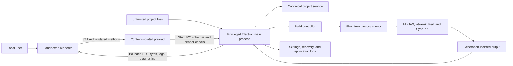

# TeXPulse Studio Threat Model

## Executive summary

TeXPulse Studio is an offline, single-user Windows desktop application that
opens local LaTeX projects, edits source, invokes MiKTeX tools, and renders
local PDF output. Project content, compiler output, recovery data, PDF data,
settings, and IPC payloads are untrusted inputs. The renderer is also treated as
untrusted.

The highest-risk boundary is local TeX execution. TeXPulse reduces that risk
with shell escape disabled, `latexmk` configuration disabled by default,
argument-array process creation, timeout and cancellation, process-tree cleanup,
bounded process capture, generated-output quotas, and generation retention.
These controls reduce abuse and data-loss risk but are not an operating-system
sandbox. Users must review projects before enabling custom executables or
`latexmk` configuration.

No known critical or high-severity finding remains in the implemented Sprint 10
scope. Residual medium risks are documented below.

## Scope and assumptions

In scope:

- the Electron main, preload, and renderer processes;
- project filesystem access and versioned writes;
- MiKTeX, `latexmk`, Perl, BibTeX, Biber, MakeIndex, and SyncTeX execution;
- generated output, PDF.js rendering, diagnostics, support logs, and recovery;
- local settings and application-data storage; and
- development dependency and release-gate controls.

Assumptions:

- the supported environment is one native Windows 11 x64 user session;
- project files may be malformed or intentionally hostile;
- the user controls the opened project and installed native toolchain;
- no cloud service, analytics, collaboration, remote compilation, update
  service, or multi-user execution exists;
- project creation and ZIP destinations are selected by the main process; and
- explicitly selected custom tools and trusted `latexmk` configuration are
  user-approved local code execution.

Out of scope:

- protection from an already-compromised Windows account or administrator;
- containment equivalent to a VM, container, or restricted OS token;
- hostile multi-user or hosted compilation; and
- network or collaboration protocols that do not exist in the product.

## System model

## Assets

- project source and externally edited file contents;
- unsaved editor buffers and recovery snapshots;
- generated PDF, log, SyncTeX, and auxiliary files;
- project and global settings;
- application diagnostic logs and exported support logs;
- the integrity of the current build generation and visible PDF;
- local filesystem paths and user-profile information; and
- availability of the editor and compiler process tree.

## Trust boundaries

1. Renderer to preload: no Node globals or raw `ipcRenderer`; only a frozen,
   typed API.
2. Preload to main IPC: trusted sender/main-frame checks plus strict request and
   response schemas.
3. Main process to project filesystem: canonical root, relative paths, component
   checks, and no traversal through links or junctions.
4. Main process to native tools: executable plus argument arrays,
   `shell: false`, controlled environment, timeout, cancellation, and output
   bounds.
5. Compiler output to application: generation identity, path validation, file
   type checks, size/count quotas, and stale-result rejection.
6. Application data to renderer: recovery, logs, settings, PDF bytes, and
   diagnostics are bounded and validated.

## Attacker capabilities

An attacker may provide a project containing malicious TeX, malformed UTF-8,
large or recursive output, hostile filenames, links or junctions, malformed
logs, a malicious PDF, `.latexmkrc`, or shell metacharacters. A compromised
renderer may submit malformed IPC payloads, attempt path traversal, navigate to
external URLs, or replay stale artifact identities. An attacker with access to
the user profile may read local application data; TeXPulse does not claim to
encrypt data at rest.

## Threats and mitigations

| ID     | Threat                                                           | Controls                                                                                                                                                                                                 | Residual risk                                                                                            |
| ------ | ---------------------------------------------------------------- | -------------------------------------------------------------------------------------------------------------------------------------------------------------------------------------------------------- | -------------------------------------------------------------------------------------------------------- |
| TM-001 | TeX or configuration executes arbitrary commands                 | `-no-shell-escape`; `-norc` by default; explicit trust warning; fixed executable discovery; argument arrays; no ordinary shell                                                                           | Medium when the user explicitly trusts custom tools or `latexmk` Perl configuration                      |
| TM-002 | Runaway compiler exhausts CPU, memory, output capture, or disk   | Configurable timeout; cancellation; Windows process-tree cleanup; 8 MiB aggregate process capture; 4,096 files, 128 MiB per file, and 512 MiB accepted-generation quotas; maximum 8 retained generations | Medium: quotas are checked after process exit, so transient resource use remains possible before timeout |
| TM-003 | Traversal, links, or malformed paths escape the project          | Canonical project root; relative path normalization; component `lstat`; no internal link/junction traversal; validated generated paths                                                                   | Low                                                                                                      |
| TM-004 | Renderer compromise reaches filesystem or native processes       | Sandbox; no Node integration; context isolation; web security; 32 fixed methods; sender/frame validation; strict schemas; local CSP                                                                      | Low                                                                                                      |
| TM-005 | Malicious or stale PDF abuses preview or replaces current output | Completed-output loading only; 100 MiB PDF limit; local pinned PDF.js worker; opaque artifact identity; current-generation revalidation; retained last-successful output                                 | Low                                                                                                      |
| TM-006 | Recovery data overwrites source or is poisoned                   | Project-ID and path validation; strict schema; 20-buffer, 2 MiB-buffer, 10 MiB-total limits; explicit review; restore to dirty editor state only; version-token save                                     | Low                                                                                                      |
| TM-007 | Logs leak source or local paths                                  | Structured event allowlist; no document content by default; 1 MiB current plus one rotated log; bounded values; user-initiated export; home/project path redaction; local-only storage                   | Medium because native raw compiler logs intentionally retain local troubleshooting text                  |
| TM-008 | Races or stale results corrupt files or visible output           | SHA-256 version tokens; atomic replacement; build IDs and monotonic generations; newest-only queue; renderer revision checks                                                                             | Low                                                                                                      |
| TM-009 | Dependency supply-chain vulnerability enters release             | Exact dependency versions; frozen lockfile; lifecycle-script allowlist; `pnpm audit --audit-level high` in CI                                                                                            | Medium because audits cannot detect every compromised or unknown package issue                           |
| TM-010 | External navigation or popup opens an unsafe URL                 | Renderer navigation and popup requests are denied; unexpected scheme is logged without retaining the full URL; CSP blocks network connections                                                            | Low                                                                                                      |
| TM-011 | Project mutation or export escapes the project or leaks output   | Main-process destinations; canonical relative mutation paths; version tokens; paused watcher; idle-session requirement; link-safe ZIP enumeration; generated/dependency/VCS exclusions                   | Low                                                                                                      |

## Abuse cases

- A renderer request containing `..\..\secret.txt` is rejected and a
  security-relevant local event is recorded without reading the external file.
- A TeX source containing shell metacharacters remains one argument and runs
  with shell escape disabled.
- A compiler emitting excessive stdout/stderr is terminated and its captured
  output is truncated.
- A generation containing too many files, oversized files, excessive aggregate
  bytes, a link, or a non-regular file is rejected and removed without following
  links.
- An abnormal shutdown leaves a bounded recovery snapshot; restart requires
  explicit review and does not write the project until the user saves.
- An attempted popup or external navigation is denied rather than delegated to
  the operating system.
- A mutation containing traversal, a stale file version, or a link component is
  rejected before data changes.
- A ZIP export skips links and generated/dependency directories and never
  accepts an absolute renderer-provided destination.
- Git awareness returns only summary counts and branch metadata from a
  shell-free, timed main-process command.

## Security requirements and verification

- `NFR-SEC-001` through `NFR-SEC-013`: Electron controls, path checks, process
  policy, output bounds, URL denial, CSP, dependency audit, and explicit
  rejection of unsandboxed multi-user compilation.
- `NFR-PRIV-001` through `NFR-PRIV-004`: local operation, no analytics or
  uploads, and practical support-export redaction.
- `FR-REC-001` through `FR-REC-008`: bounded recovery, explicit review,
  resilient compiler/PDF behavior, local logging, and user-controlled cleanup.
- `AS-008`: abnormal-shutdown Electron E2E verifies editor-only recovery and
  explicit save.
- `AS-009`: IPC integration verifies traversal rejection and security logging.

Automated evidence includes unit, component, integration, coverage, Electron
E2E, output-limit, timeout, shell-metacharacter, shell-escape, navigation, CSP,
log-redaction, recovery, and dependency-audit checks. Native MiKTeX recipes and
a rendered PDF are reviewed separately.

## Residual risks and follow-up

- TeX executes with the desktop user's permissions. The release candidate does
  not add an OS sandbox, restricted token, VM, or filesystem quota.
- Generated-output quotas reject and remove output after the compiler exits;
  they do not prevent transient disk growth during the compile.
- Enabling custom executables or `latexmk` configuration expands the trusted
  computing base and must remain an explicit, visible choice.
- Recovery and application logs are local plaintext files protected by the
  user's Windows profile permissions.
- MiKTeX package installation and update behavior is outside the application.
- The installer remains unsigned. SmartScreen reputation and signed-artifact
  operations require a future certificate and controlled signing environment.
- Classic NSIS output embeds build metadata, so the tagged source archive and
  recorded artifact hashes are the provenance controls; byte-identical installer
  rebuilds are not claimed.
